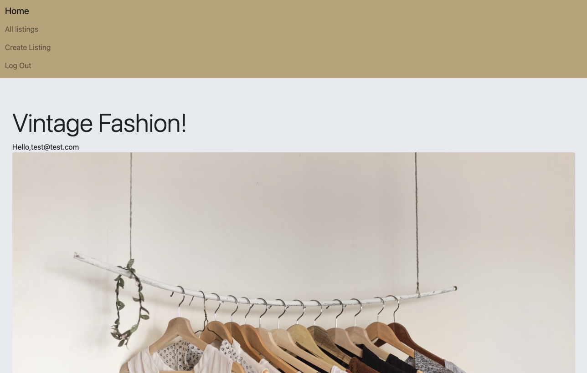
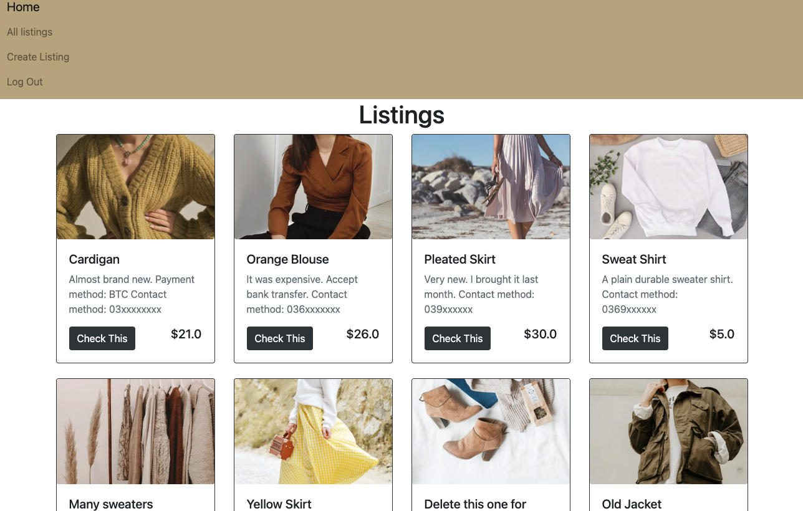

# Vintage Fashion






## A link (URL) to your deployed app

The live demo of  the website is:[here](https://vintage-fashion2.herokuapp.com/)

Login Details of testing account:
Email: test@test.com
Password: 123456

## A link to your GitHub repository

View the source code:[here](https://github.com/xinyirachel/VintageFashion)

## About Vintage Fashion

A prototype non-profit website on which users can log in, upload, buy, exchange and sell their old clothes. The app was created in Ruby on Rails with a PostgreSQL database and deployed using Heroku. It demonstrates CRUD implementation, AWS S3 image storage and user authentication with permissions.

## How to run the app locally
To run Vintage Fashion locally you need to:
1.  Download the repository as a ZIP file, and unpack it into your local environment
**OR**
2.  Clone the repository with the command in your CLI locally.


Please note that:
- You are using >= `Ruby version 3.0.2`, >= `Rails version  6.1.6.1` 
- You have Postgres installed in your local environment.
- The application makes use of `Bootstrap version 4`

Rails Setup:
To get the `Rails` server up and running you'll need to run the following in your CLI:

```
bundle install
rails db:create
rails db:migrate
rails db:seed
```
To start server you'll need to run the following in your CLI:

```
rails s
```
Then go to **http://localhost:3000/** in your browser.

## Amazon S3 Setup

You'll need to create your own credentials file to configure your own S3 storage. To do this, you need to delete the existing `credentials.yml.enc`, and then open the credentials file where you will paste your `access key` and `secret access key`for Amazon's S3 storage. Within the `storage.yml` file located in the `config` folder, you will also need to change the name of the S3 bucket from `xinyi-vintagefashion`:

## Features
* Users can view all listings but if they want to post anything they need to sign in. They can sign up an account to do that. 

* Users can create a list with their product information and edit/delete it. They cannot make changes to other people's post. 

* The app also has donation to developer system, user can click the button to go to payment information page, then enter their card information. They can see the "payment sucessful" page if they made a sucessful payment.(Coming soon)

## Tech stack
The following tech stack were used:
- HTML
- CSS/SCSS
- JavaScript
- Ruby
- Ruby on Rails
- PostgreSQL
- Device 
- Bootstrap
- AWS S3
- Heroku

